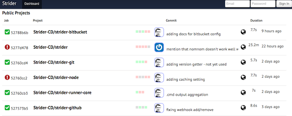
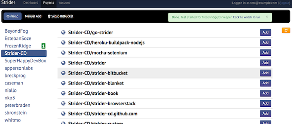
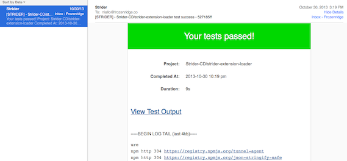
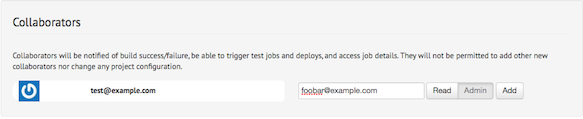
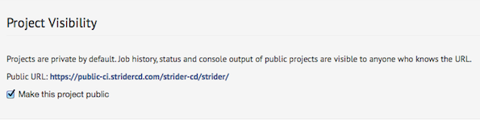
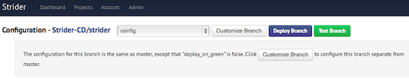

Introduction
============

What Is Strider
---------------

Strider is an Open Source Continuous Integration and Deployment platform. It is
written in JavaScript/Node.JS and uses MongoDB. It is released under the BSD
license. While similar conceptually to systems such as Travis and Jenkins,
Strider is designed to be easy to setup, use, and customize.

What Is Continuous Integration
------------------------------

Continuous Integration (a.k.a. CI) is a software engineering process.  It can be
defined as running an automated test suite on every commit to a software project
and notifying on success and failure. 

CI is beneficial as it greatly increases the feedback developers receive on
each commit, and the health and well-being of the software overall. It is
amazing how many bugs can be found which otherwise would remain covered due to
particulars of development environments.

The faster your team gets feedback on bugs and regressions, the sooner your release is ready!

What Is Continuous Deployment
------------------------------

At a high level, Continuous Deployment (a.k.a. CD) extends Continuous
Integration to include automated deployment. This can vary from full
"deploy-on-green" whereby the system is automatically deployed to production
every time the tests pass, to more conservative automatic deployment to staging
with a manual push to production.

Continuous Deployment typically includes a notion of "feature flippers" which enable new features to be
rolled out gradually, to a subset of customers, or quickly toggled off if they cause issues.

CD makes the software release feedback loop as tight as possible.

Strider Philosophy
------------------

We believe that Continuous Integration and Continuous Deployment processes
improve the quality and reliability of software.

We want to make these processes more accessible, and one of the main blockers
is well-designed, high quality CI and CD tooling.

By choosing sane defaults, automating to the extent possible, and minimizing
extraneous UI, Strider can elegantly meet the needs of 80+% users out of the box.

However we realise that in the real-world, integration with other systems and
customization is often required. For this reason, Strider has been designed
from the ground up to be as easy as reasonably possible to customize and extend
- in very powerful ways.

Strider has robust support for extensions (which are simply NPM modules). Have
a complex workflow to trigger builds and deployments? Write a Job plugin to
handle it. Use an unsupported VCS? Write a Provider plugin.

Features
--------

Strider has the following major features:

Dashboard
^^^^^^^^^

Stylish dashboard displaying the current and recent test and deploy status of
each project:

Github, Github Enterprise, BitBucket
^^^^^^^^^^^^^^^^^^^^^^^^^^^^^^^^^^^^

Strider integrates with Github, Github Enterprise, BitBucket, GitLab and more.
Intuitively add projects for CI and CD with only a few clicks. No messing with
scripts or SSH keys - Strider does it for you.

Email And Webhook Notifications
^^^^^^^^^^^^^^^^^^^^^^^^^^^^^^^

Notification on success and failure. Emails work out of the box to notify
humans, Webhooks supported for notifying machines. Want a custom notification
method? It's easy to develop a plugin.

Teams and Collaborators
^^^^^^^^^^^^^^^^^^^^^^^

Development teams via "collaborators". Give other users read-only access or
full admin rights to your projects.

Public Projects
^^^^^^^^^^^^^^^

Let the world at large see your project status dashboard!  Public projects may
be browsed by anonymous users, but not triggered nor configured. Great for Open
Source projects. See Strider's public CI dashbaord at
https://public-ci.stridercd.com.

Branches
^^^^^^^^

Each VCS branch may be configured independently, including different
deployment configuration. Use this to create powerful workflows.  For example,
"master" branch may only deploy to production with a manual trigger while
"testing" branches deploy to QA automatically on each successful test run.

Pull Requests
^^^^^^^^^^^^^

GitHub pull requests can be automatically tested when they are opened, with
test result status sent back to GitHub to mark the PR. For security reasons,
this is only enabled for specific users which you whitelist.

Advanced Shell Scripting
^^^^^^^^^^^^^^^^^^^^^^^^

Script each phase of each project from the web or config file. Custom prepare,
test and deploy scripts easily enable integration with your specific language,
environment and existing automation.

Heroku Support
^^^^^^^^^^^^^^

Deploy directly to Heroku apps with the ``strider-heroku`` plugin.

Node.js And Python
^^^^^^^^^^^^^^^^^^

Out-of-box support for Node.JS and Python projects. Other languages /
environments can be supported with thirdparty plugins or custom scripts.

Front-end JavaScript testing with Sauce Labs
^^^^^^^^^^^^^^^^^^^^^^^^^^^^^^^^^^^^^^^^^^^^

Easily configure SauceLabs.com credentials and select os/browser combinations
via Strider's web UI. Strider will even manage the Sauce Connect proxy for you
- waiting for it to be connected before running your tests.

Extensibility
^^^^^^^^^^^^^

Strider is designed to be highly extensible. The core is minimal, with most
features implemented in plugins (e.g. strider-heroku, strider-github,
strider-sauce). In keeping with Node.JS, Strider plugins are simply NPM
modules. This makes it easy to support new VCS providers, deployment targets,
languages or environments and so on. See the chapter on Extending Strider for
more!

Commercial Support
^^^^^^^^^^^^^^^^^^

FrozenRidge, LLC provides commercial support including training,
customization/integration and cloud-hosting. Email hi@frozenridge.co to learn
more.
